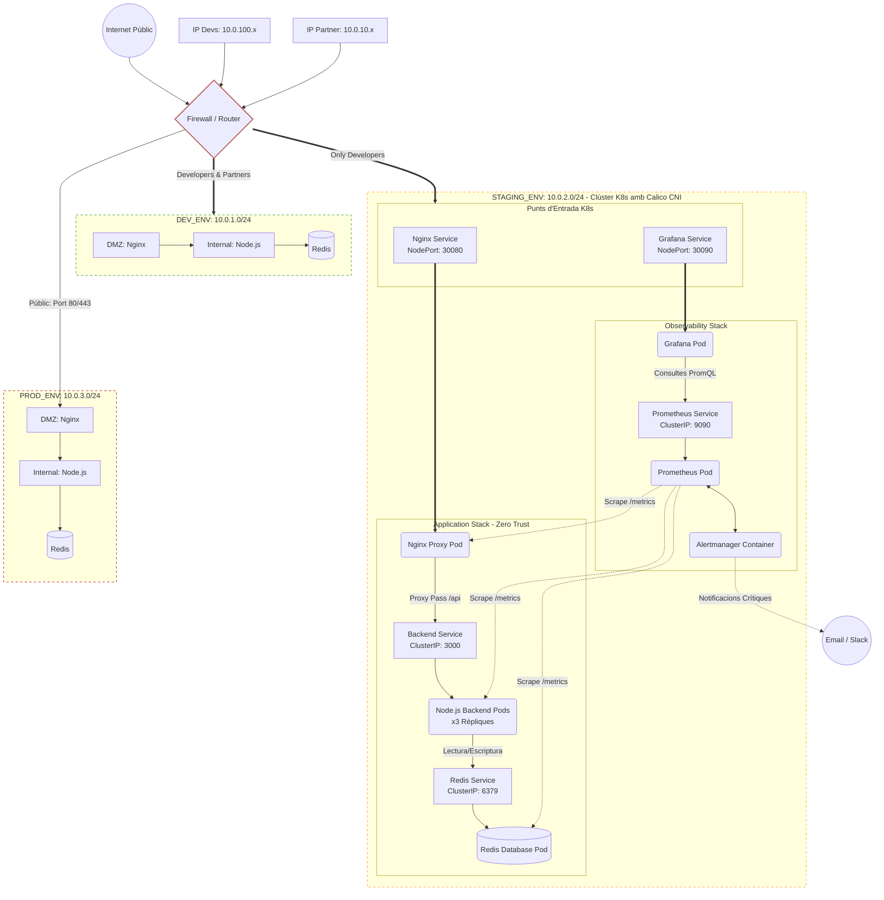

# GreenDevCorp Enterprise IT Infrastructure & Application Platform

Benvingut al repositori central d'infraestructura i sistemes de **GreenDevCorp**. Aquest projecte recull tota l'evolució, l'arquitectura de programari i el provisionament automatitzat de la plataforma tecnològica de l'organització, des de la fase inicial de contenidorització fins al clúster elàstic i protegit actual.

La solució s'ha construït seguint els estàndards de l'estat de l'art, consolidant una aplicació distribuïda altament disponible, monitoritzada de manera proactiva i blindada sota un model estricte de seguretat **Zero Trust** mitjançant **Infraestructura com a Codi (IaC)**.

---

## 1. Evolució Cronològica del Projecte (Setmana a Setmana)

L'estat actual de la infraestructura és el resultat d'un procés d'enginyeria incremental dividit en les següents fites clau:

* 🐳 **Week 8: Containerization (Docker)**
  * Disseny i construcció de imatges aïllades i optimitzades mitjançant `Dockerfiles` per a l'aplicació backend (Node.js) i el servidor web proxy (Nginx), garantint entorns d'execució repetibles i lleugers.
* 📦 **Week 9: Multi-Container Orchestration (Docker Compose)**
  * Interconnexió local i definició multi-contenidor. Ús de `docker-compose.yml` per orquestrar de manera unificada tot l'stack tecnològic: Nginx a la capa DMZ, l'API de Node.js a la capa interna de negoci i Redis com a motor de memòria cau de dades.
* 🏗️ **Week 10: Orchestration (Kubernetes)**
  * Migració de l'arquitectura cap a objectes natius de clúster clau empresarial (Deployments, Serveis de xarxa i ConfigMaps), establint les bases de l'alta disponibilitat, el balançament de càrrega i l'escalabilitat elàstica de pods.
* 🤖 **Week 11: Infrastructure as Code & CI/CD**
  * Automatització integral del cicle de vida. Transició cap a un aprovisionament 100% declaratiu gestionat per **Terraform** per evitar la configuració manual. Integració de pipelines d'automatització i CI/CD per al control de versions de la infraestructura.
* 🛡️ **Week 12: Network Design & Identity**
  * Implementació de seguretat *Zero Trust* perimetral (DMZ i capes de xarxa internes). Configuració de **NetworkPolicies** complexes a Terraform executades realment pel motor de xarxa **Calico CNI** per bloquejar el trànsit no autoritzat. Recerca dels serveis de infraestructura core d'identitat i control (`DNS`, `DHCP`, `NTP`, `LDAP/Active Directory`).
* 📊 **Week 13: Integration, Observability & Finalization**
  * Finalització dels reptes d'enginyeria de producció (Challenge A, B, C). Desplegament automàtic de l'stack d'observabilitat format per **Prometheus** (*scraping* de telemetria), **Alertmanager** (encaminament de notificacions crítiques com CPU > 60% o errors 5xx) i **Grafana** (visualització en temps real). Validació del sistema mitjançant injecció de caos i estrès de trànsit.

---

## 2. Mapa de l'Arquitectura Global (Challenge C)

El següent diagrama representa la integració de la xarxa corporativa de l'organització amb la visió interna detallada del clúster de Kubernetes deployed a l'entorn de Staging mitjançant Terraform:



---

## 3. Quick Start (Com posar el sistema en marxa?)

El cicle de creació de la infraestructura està completament programat per evitar errors humans. Per realitzar un **Arranque en Fred (Cold Start)** de l'entorn:

1. **Garantir els Prerequisits:** Assegura't de tenir instal·lats: `Docker`, `Minikube`, `Terraform` i `kubectl`.

2. **Executar el Script d'Orquestració:** A la línia de comandes de l'arrel del projecte, llança:

    ```bash
    ./deploy.sh
    ```

3. **Seleccionar l'Entorn de Staging:** Introdueix la **Opció 2** al menú interactiu. El script s'encarregarà de netejar clústers antics residuals, arrencar Minikube configurant el CNI avançat de **Calico** (`--cni=calico`), inicialitzar els proveïdors de Terraform i aplicar tota la configuració de recursos.

4. **Temps d'espera operatiu:** El procés trigarà uns **2 minuts** aproximadament en descarregar els binaris i estabilitzar la xarxa. Pots verificar l'estat dels pods executant: `kubectl get pods -A -w`.

---

## 4. Operational Runbook i Gestió

### Com accedir a l'Stack d'Observabilitat (Challenge A)

1. Des de la terminal, executa el script de connexió automatitzat:

   ```bash
   ./observability.sh
   ```

2. El script obrirà automàticament la interfície web de Grafana al teu navegador.
3. Inicia sessió introduint l'usuari i la contrasenya configurats de forma segura als teus fitxers de variables secretes.
4. Selecciona el panell de control (*dashboard*) pre-configurat per començar a analitzar el trànsit, rèpliques i mètriques de rendiment.

### Com desplegar una nova versió de l'aplicació

1. El pipeline genera la nova imatge binària de Docker etiquetada automàticament amb el hash del darrer commit realitzat (format `sha-xxxx`).
2. Aquest nou tag identificador s'actualitza i es configura dins dels fitxers de variables secretes i protegides d'entorn (`.tfvars`).
3. S'executa novament el script `./deploy.sh` seleccionant l'entorn on s'hagi aplicat la nova imatge per aplicar un *Rolling Update* segur i sense temps d'inactivitat al clúster.

---

## 5. Índex de Documentació del Projecte

Tots els informes d'enginyeria detallats, codi font, justificacions i guies addicionals estan segmentats per setmanes als següents directoris directes:

* 📁 **Fase d'Arquitectura i Desenvolupament Base:**
  * 🛠️ **[Week 8 - Containerization (Docker)](docs/week8/README.md)**
  * 🐳 **[Week 9 - Multi-Container Orchestration (Docker Compose)](docs/week9/README.md)**
  * 📦 **[Week 10 - Orchestration (Kubernetes)](docs/week10/README.md)**
* 📁 **Fase de Seguretat d'Empresa, Cloud Native i Operacions (IaC):**
  * 🤖 **[Week 11 - Infrastructure as Code & CI/CD](docs/week11/README.md)**
  * 🌐 **[Week 12 - Network Design & Identity](docs/week12/README.md)**
  * 📊 **[Week 13 - Integration, Observability & Finalization](docs/week13/FULL_INTEGRATION_TEST.md)**
  * 📖 **[Manual Operatiu i Guia de Resolució de Problemes (Runbook & Troubleshooting)](docs/week13/README.md)**
