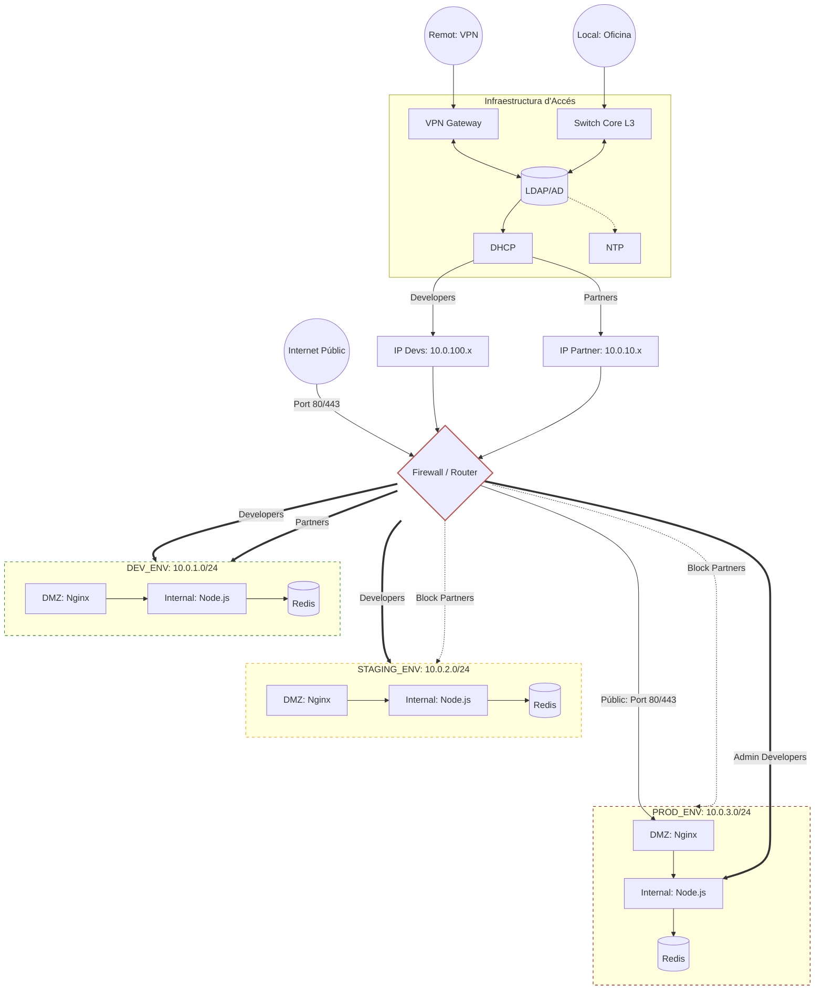

# Setmana 12: Disseny de Xarxa i Identitat

Aquest document detalla el disseny de la arquitectura de la xarxa de GreenDevCorp segons la Setmana 12.

## 1. Diagrama de l'Arquitectura de la Xarxa


## 2. Planificació de les IPs

- **Organization**: `10.0.0.0/16` -> 65,534 IPs.
- **Development Environment**: `10.0.1.0/24` -> 254 IPs.
- **Staging Environment**: `10.0.2.0/24` -> 254 IPs.
- **Production Environment**: `10.0.3.0/24` -> 254 IPs.
- **Partners**: `10.0.10.0/24` -> 254 IPs.
- **Developers**: `10.0.100.0/24` -> 254 IPs. 

**Justificació del Disseny**:

Aquest disseny es basa en la segmentació per zones per garantir la seguretat i l'operabilitat, on cada entorn queda separat en una subnet diferent. 

- **Identitat i Control d'Accés**: quan un usuari es connecta (via VPN IPsec o localment), s'identifica mitjançant el directori central (LDAP). Segons el seu rol, el servidor DHCP li assigna una adreça IP del rang corresponent.

- **Polítiques del Firewall (L3/L4)**: el Firewall actua com el punt de decisió central. Els *Developers* (`10.0.100.x`) tenen accés als entorns, mentre que els *Partners* (`10.0.10.x`) tenen el seu trànsit restringit únicament a entorns no productius (Development).

- **Protecció Exterior (DMZ)**: el trànsit públic viatja obligatòriament a través de la capa DMZ cap al contenidor proxy (Nginx). La base de dades i el codi backend resideixen en capes internes inaccessibles directament des de l'exterior.

## 3. Implementació de Kubernetes NetworkPolicies (IaC)

Per traslladar aquest model de seguretat estricte al clúster, s'ha evitat l'ús de desenes d'arxius YAML manuals (que són propensos a errors humans) i s'han definit **regles complexes de tallafocs integrades directament com a codi a Terraform** (`main.tf`). 

S'ha establert un model **Zero Trust** (Confiança Cero) basat en les següents regles provisionades dinàmicament:
1. **Default Deny All:** Bloqueja absolutament tot el trànsit d'entrada i sortida al *namespace*.
2. **Allow Nginx to Backend:** Només permet l'ingrés al port 3000 si el trànsit prové de l'etiqueta `app=nginx-gsx` o de la subxarxa de *Developers* (`10.0.100.0/24`).
3. **Allow Backend to Redis:** Protegeix la BD permetent només consultes que provinguin exclusivament dels pods del backend.
4. **Egress Isolation:** Permet la sortida a Internet (`0.0.0.0/0`) per a descàrregues/DNS, però **bloqueja explícitament** el trànsit cap a les subxarxes dels altres entorns corporatius per evitar salts laterals en cas d'infecció.

### Proves d'Aïllament en Entorn Real (Calico CNI)
Per defecte, l'entorn de desenvolupament local Minikube ignora les *NetworkPolicies*. Per tal de fer complir el tallafocs de manera real, hem modificat l'script d'automatització (`deploy.sh`) per construir la xarxa del clúster utilitzant el motor empresarial **Calico CNI** (`minikube start --cni=calico`).

A continuació es mostren les proves d'intrusió des del terminal demostrant l'èxit de les polítiques:

```bash
# 1. Trànsit permès: El Backend pot parlar amb la BD Redis
$ kubectl exec -it deployment/gsx-app-deployment -- nc -zv redis-service 6379
redis-service (10.99.204.52:6379) open

# 2. Trànsit bloquejat: Es denega l'accés directe des del Proxy web cap a la BD
$ kubectl exec -it deployment/nginx-deployment -- nc -w 2 -zv redis-service 6379
nc: redis-service (10.99.204.52:6379): Operation timed out
command terminated with exit code 1

# 3. Prevenció de Salts Laterals: El Backend no pot tocar altres xarxes corporatives (Egress)
$ kubectl exec -it deployment/gsx-app-deployment -- nc -w 2 -zv 10.0.1.50 80
nc: 10.0.1.50 (10.0.1.50:80): Operation timed out
command terminated with exit code 1
```
## 4. Documentació dels Security Boundaries

- **What traffic is allowed between networks?**
  
  El tràfic segueix el model de **Mínim Privilegi**: 
  
  a. Public -> DMZ: accés HTTP des d'Internet a Nginx.

  b. DMZ -> Internal: des del proxy Nginx fins a l'aplicació Node.js.
  
  c. Internal -> Database: només el Node.js pot consultar Redis.
  
  d. Devs -> All: accés administratiu a la subxarxa de gestió `10.0.100.0/24` cap als serveis per tasques de *debugging*.
      
- **What traffic is blocked? Why?**
  
  a. Public -> Database: Bloquejat absolutament per evitar exfiltració de dades.
  
  b. Entre Entorns (Ex: Staging -> Production): Bloquejat per evitar que un atacant faci moviments laterals.
  
  c. Partners -> Production: Bloquejat per restringir el risc de cadena de subministrament; només accedeixen a Dev.
      
- **How do you prevent accidental misconfiguration?**
  
  Implementant la regla central de **Default Deny All** a Terraform. Així, qualsevol pod nou que es desplegui neix totalment aïllat de la xarxa per defecte, obligant a l'enginyer a declarar un permís d'obertura explícit de manera conscient.

---

## 5. Research: Core Services

### 5.1 DNS (Domain Name System)
- **What is DNS? What problem does it solve?** És un sistema que tradueix noms de domini llegibles per humans (com `greendevcorp.com`) en adreces IP numèriques que utilitzen les màquines (com `192.168.1.100`). Resol el problema d'haver de memoritzar IPs.
- **Why does an organization need DNS?** Per facilitar la navegació interna, permetent als empleats accedir a eines com `intranet.local` en lloc d'haver de teclejar la IP exacta del servidor, la qual pot canviar amb el temps.
- **How does DNS work (high-level)?** L'usuari escriu una URL al navegador. L'ordinador pregunta al servidor DNS corporatiu quina IP té aquell nom. Si el servidor ho sap, retorna la IP; si no, pregunta a servidors arrel superiors fins a trobar-la.
- **Explain to a non-technical person:** Imagina que el DNS és com l'agenda de contactes del teu telèfon. Tu només has de recordar el nom d'un amic ("Marta") i al prémer sobre ell, el telèfon s'encarrega de marcar el número llarg associat (la IP) per connectar la trucada.

### 5.2 DHCP (Dynamic Host Configuration Protocol)
- **What is DHCP? What problem does it solve?** És un protocol de xarxa que assigna automàticament adreces IP i altres configuracions de xarxa als dispositius que es connecten. Evita conflictes d'IP (dues màquines usant la mateixa) i la feixuga tasca d'assignar-les manualment una per una.
- **Why would an organization use DHCP?** En una empresa on la gent es connecta i desconnecta constantment amb portàtils i mòbils, el DHCP automatitza l'entrada a la xarxa, atorgant IPs dinàmiques segons l'àrea on es connectin.
- **How does DHCP work (high-level)?** Segueix el procés DORA: Un ordinador es connecta i crida a la xarxa demanant una IP (*Discover*). El servidor DHCP li ofereix una (*Offer*). L'ordinador la sol·licita formalment (*Request*), i el servidor confirma l'assignació per un temps determinat (*Acknowledge*).
- **Explain to a non-technical person:** Imagina un guarda-roba en un gran esdeveniment. Quan arribes, el responsable (DHCP) et dona un tiquet amb un número temporal (IP) perquè puguis moure't pel recinte. Quan marxes, tornes el tiquet perquè un altre convidat el pugui fer servir.

### 5.3 NTP (Network Time Protocol)
- **What is NTP? Why does time synchronization matter?** NTP és un protocol encarregat de sincronitzar els rellotges de tots els ordinadors i servidors d'una xarxa. La sincronització és vital perquè els sistemes informàtics i de seguretat depenen de marques de temps exactes per funcionar.
- **Why is synchronized time important for security and operations?** A nivell de seguretat, l'encriptació i els certificats TLS/SSL fallen si els rellotges no coincideixen. A nivell operatiu, si un hacker ataca l'empresa, els enginyers necessiten comparar els *logs* de diferents servidors; si l'hora no és exactament la mateixa al mil·lisegon, és impossible traçar l'origen de l'atac.
- **Explain to a non-technical person:** És com quan un grup de lladres de pel·lícula sincronitzen els seus rellotges abans d'un atracament. Si tots no tenen exactament la mateixa hora al mateix segon, les accions combinades fallaran i el pla serà un desastre.

---

## 6. Research: Identity Management

### 6.1 Authentication vs. Authorization
- **Autenticació:** És el procés de verificar *qui ets*. Normalment s'aconsegueix validant el que l'usuari sap (una contrasenya), el que té (el mòbil per MFA) o el que és (empremta dactilar). Ex: Ensenyar el DNI a la porta.
- **Autorització:** És el procés de verificar *què pots fer* un cop has entrat. Es basa en els teus permisos i rols assignats. Ex: Un cop has ensenyat el DNI (autenticació), el vigilant comprova si el teu rol és "Convidat" (no pots entrar a la sala VIP) o "Staff" (sí que pots entrar).

### 6.2 Centralized Identity (LDAP / AD / SSO)
Mantenir comptes d'usuari independents a cada màquina d'una empresa és insostenible i perillós. Eines com **LDAP** (Directori Lleuger) o **AD** (Active Directory) centralitzen tots els usuaris en una sola base de dades. 

El **SSO** (Single Sign-On) utilitza això perquè l'empleat iniciï sessió un sol cop al matí i pugui accedir a totes les seccions sense tornar a posar claus. Si l'empleat marxa de l'empresa, bloquejant un sol compte central, se li talla l'accés a tot arreu immediatament.

### 6.3 Estratègia d'Identitat per a GreenDevCorp 

Atès que GreenDevCorp ja supera els 20 treballadors i creix cap als 50, gestionar comptes de xarxa manualment ja no és segur ni eficient. 

La **opció estratègica** és adoptar una solució d'Identitat basada en el núvol i orientada a SSO (com Google Workspace o Okta) integrada com a proveïdor d'identitat (IdP) principal, amb polítiques obligatòries d'autenticació multifactor (MFA). 
- *Avantatges:* Redueix els tiquets de suport per contrasenyes oblidades, facilita el procés d'onboarding/offboarding d'empleats i afegeix capes de seguretat d'autenticació modernes sense haver de mantenir servidors físics LDAP a l'oficina.
- *Inconvenients (Trade-offs):* Suposa un cost fix mensual per llicència d'usuari i crea una dependència directa d'un proveïdor extern; si el servei del proveïdor cau, l'empresa no es pot autenticar enlloc.

---

## Nivell Intermedi (**) - Disseny de Xarxa i Connectivitat Avançada

### 1. Connectivitat VPN entre Oficines (Site-to-Site)
Actualment, GreenDevCorp compta amb dues oficines físiques ubicades en països diferents. Per tal de permetre que els treballadors d'ambdues seus puguin col·laborar i accedir als recursos interns compartits de forma segura a través d'una xarxa pública (Internet), la millor estratègia és implementar una **VPN Site-to-Site (IPsec)**. 

S'instal·la un *VPN Gateway* a la vora de la xarxa de cada oficina. Aquests dos dispositius negocien un túnel xifrant tot el trànsit que viatja entre les seus. Així, l'experiència és totalment transparent; un desenvolupador a l'oficina A pot fer *ping* o accedir a un servidor de l'oficina B com si estiguessin connectats al mateix *switch* local, però tota la informació viatja blindada (mitjançant AES-256) per evitar intercepcions.

### 2. Exposició de Serveis a Partners Externs
Per donar accés a socis externs (*partners*) a un servei intern específic sense comprometre la resta del clúster corporatiu, aplicarem capes de seguretat:

1. **IP Whitelisting (CIDR):** Tal com hem demostrat a les nostres polítiques, restringirem l'accés a nivell de xarxa permetent l'entrada exclusivament a les IPs públiques conegudes de les oficines dels *partners* (`10.0.10.0/24`).
2. **Autenticació i Ingress Controller:** L'accés es farà a través d'un *API Gateway* amb HTTPS obligatori, validant l'autenticació mitjançant tokens segurs (OAuth2 o JWT) abans de permetre el pas.
3. **Aïllament de Xarxa (DMZ Interna):** El servei exposat estarà subjecte a polítiques d'egrés (*Egress Isolation*). Si els credencials del partner es veuen compromesos, l'atacant no podrà utilitzar aquell servei exposat per fer un salt lateral cap a la base de dades ni infiltrar-se a l'entorn de Producció.