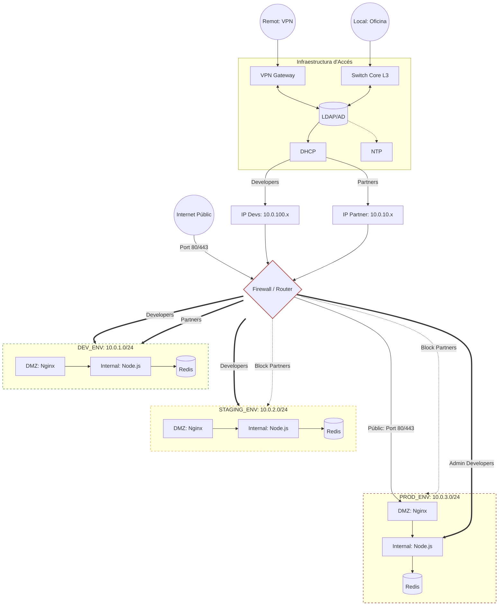

# Setmana 12: Disseny de Xarxa i Identitat

Aquest document detalla el disseny de la arquitectura de la xarxa de GreenDevCorp segons la Setmana 12.

## 1. Diagrama de l'Arquitectura de la Xarxa


## 2. Planificació de les IPs

- **Organization**: `10.0.0.0/16` -> 65,534 IPs.
- **Development Environment**: `10.0.1.0/24` -> 254 IPs.
- **Staging Environment**: `10.0.2.0/24` -> 254 IPs.
- **Production Environment**: `10.0.3.0/24` -> 254 IPs.
- **Partners**: `10.0.10.0/24` -> 254 IPs.
- **Developers**: `10.0.100.0/24` -> 254 IPs. 

**Justificació del Disseny**:

Aquest disseny es basa en la segmentació per zones per garantir la seguretat i l'operabilitat, on cada entorn queda separat en una subnet diferent. 

- **Identitat i Control d'Accés**: quan un usuari es connecta (via VPN IPsec o localment), s'identifica mitjançant el directori central (LDAP). Segons el seu rol, el servidor DHCP li assigna una adreça IP del rang corresponent.
- **Polítiques del Firewall (L3/L4)**: el Firewall actua com el punt de decisió central:
  - Developers `10.0.100.x/24`, els quals tenen accés a qualsevol entorn.
  - Partners `10.0.10.x/24`, els quals només tenen accés a la subnet de desenvolupament.
- **Protecció Exterior (DMZ)**: els usuaris externs accedeixen a través d'Internet i són redirigits pel Firewall exclusivament a l'Nginx de Producció. Aquest Nginx es troba al segment DMZ, el qual controla l'accés, i en cas d'atac no es pot accedir a la zona interna on es troba Node o Redis.

# 3. Implementació de Kubernetes NetworkPolicies

Per traslladar el disseny de xarxa al clúster, hem implementat polítiques de seguretat a nivell que forcen la segmentació definida als Pods.

**Manifests**
1. Development:
   Només permet l'accés a Partners i Devs en aquest entorn, i no permet sortir a altres subnets.
    ```yml
    apiVersion: networking.k8s.io/v1
    kind: NetworkPolicy
    metadata:
      name: dev-allow-devs-partners
      namespace: development
    spec:
      podSelector: {}
      policyTypes:
        - Ingress
        - Egress
      ingress:
        - from:
            - podSelector: {}
              # all access
        - from:
            - ipBlock:
                cidr: 10.0.10.0/24 # Partners
            - ipBlock:
                cidr: 10.0.100.0/24 # Devs
      egress:
        # Allow outer connection
        - to:
            - ipBlock:
                cidr: 0.0.0.0/0
                except:
                  - 10.0.3.0/24 # Production subnet
    ```
    
Proves:
```bash
# Deployment
❯ kubectl apply -f . -n development
configmap/app-config unchanged
deployment.apps/gsx-app-deployment created
service/gsx-backend-service created
networkpolicy.networking.k8s.io/dev-allow-devs-partners unchanged
configmap/nginx-config unchanged
deployment.apps/nginx-deployment created
service/gsx-nginx-service created
deployment.apps/redis-deployment created
service/redis-service created

# Test going from Nginx -> Redis
❯ kubectl exec -n development -it nginx-deployment-bd697789b-2q5fl -- nc -zv redis-service 6379
redis-service (10.107.236.113:6379) open

# Test going from Development -> Production
❯ kubectl exec -n development -it gsx-app-deployment-f485b9cf8-9jqw2 -- nc -w 2 -zv 10.0.3.50 6379
nc: 10.0.3.50 (10.0.3.50:6379): Operation timed out
command terminated with exit code 1

# Test going from Development -> Staging
❯ kubectl exec -n development -it gsx-app-deployment-f485b9cf8-9jqw2 -- nc -w 2 -zv 10.0.2.50 6379
nc: 10.0.2.50 (10.0.2.50:6379): Operation timed out
command terminated with exit code 1

# Test outside connection (to Google)
❯ kubectl exec -n development -it gsx-app-deployment-f485b9cf8-9jqw2 -- nc -w 2 -zv 8.8.8.8 53
8.8.8.8 (8.8.8.8:53) open
```
3. Stagint:
4. Production:
   
