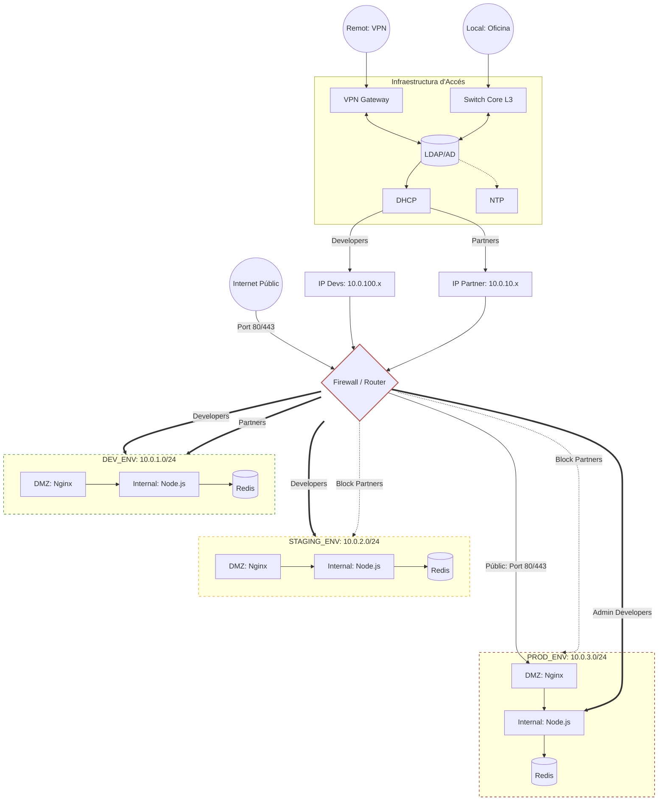

# Setmana 12: Disseny de Xarxa i Identitat

Aquest document detalla el disseny de la arquitectura de la xarxa de GreenDevCorp segons la Setmana 12.

## 1. Diagrama de l'Arquitectura de la Xarxa


## 2. Planificació de les IPs

- **Organization**: `10.0.0.0/16` -> 65,534 IPs.
- **Development Environment**: `10.0.1.0/24` -> 254 IPs.
- **Staging Environment**: `10.0.2.0/24` -> 254 IPs.
- **Production Environment**: `10.0.3.0/24` -> 254 IPs.
- **Partners**: `10.0.10.0/24` -> 254 IPs.
- **Developers**: `10.0.100.0/24` -> 254 IPs. 

**Justificació del Disseny**:

Aquest disseny es basa en la segmentació per zones per garantir la seguretat i l'operabilitat, on cada entorn queda separat en una subnet diferent. 

- **Identitat i Control d'Accés**: quan un usuari es connecta (via VPN IPsec o localment), s'identifica mitjançant el directori central (LDAP). Segons el seu rol, el servidor DHCP li assigna una adreça IP del rang corresponent.
- **Polítiques del Firewall (L3/L4)**: el Firewall actua com el punt de decisió central:
  - Developers `10.0.100.x/24`, els quals tenen accés a qualsevol entorn.
  - Partners `10.0.10.x/24`, els quals només tenen accés a la subnet de desenvolupament.
- **Protecció Exterior (DMZ)**: els usuaris externs accedeixen a través d'Internet i són redirigits pel Firewall exclusivament a l'Nginx de Producció. Aquest Nginx es troba al segment DMZ, el qual controla l'accés, i en cas d'atac no es pot accedir a la zona interna on es troba Node o Redis.

# 3. Implementació de Kubernetes NetworkPolicies

Per traslladar el disseny de xarxa al clúster, hem implementat polítiques de seguretat a nivell que forcen la segmentació definida als Pods.

**Manifests**
1. Development:
   Només permet l'accés a Partners i Devs en aquest entorn, i no permet sortir a altres subnets.
    ```yml
    apiVersion: networking.k8s.io/v1
    kind: NetworkPolicy
    metadata:
      name: dev-allow-devs-partners
      namespace: development
    spec:
      podSelector: {}
      policyTypes:
        - Ingress
        - Egress
      ingress:
        - from:
            - podSelector: {}
              # all access
        - from: # Allow
            - ipBlock:
                cidr: 10.0.10.0/24 # Partners
            - ipBlock:
                cidr: 10.0.100.0/24 # Devs
      egress:
        # Allow outer connection
        - to:
            - ipBlock:
                cidr: 0.0.0.0/0
                except:
                  - 10.0.3.0/24 # Production subnet
    ```
    
Proves:
```bash
# Deployment
❯ kubectl apply -f . -n development
configmap/app-config unchanged
deployment.apps/gsx-app-deployment created
service/gsx-backend-service created
networkpolicy.networking.k8s.io/dev-allow-devs-partners unchanged
configmap/nginx-config unchanged
deployment.apps/nginx-deployment created
service/gsx-nginx-service created
deployment.apps/redis-deployment created
service/redis-service created

# Test going from Nginx -> Redis
❯ kubectl exec -n development -it nginx-deployment-bd697789b-2q5fl -- nc -zv redis-service 6379
redis-service (10.107.236.113:6379) open

# Test going from Development -> Production
❯ kubectl exec -n development -it gsx-app-deployment-f485b9cf8-9jqw2 -- nc -w 2 -zv 10.0.3.50 6379
nc: 10.0.3.50 (10.0.3.50:6379): Operation timed out
command terminated with exit code 1

# Test going from Development -> Staging
❯ kubectl exec -n development -it gsx-app-deployment-f485b9cf8-9jqw2 -- nc -w 2 -zv 10.0.2.50 6379
nc: 10.0.2.50 (10.0.2.50:6379): Operation timed out
command terminated with exit code 1

# Test outside connection (to Google)
❯ kubectl exec -n development -it gsx-app-deployment-f485b9cf8-9jqw2 -- nc -w 2 -zv 8.8.8.8 53
8.8.8.8 (8.8.8.8:53) open
```

3. Staging:
   
Només permet l'accés als Developers, però només poden accedir per el frontal DMZ (Nginx)
```yml
apiVersion: networking.k8s.io/v1
kind: NetworkPolicy
metadata:
  name: allow-devs-only
  namespace: staging
spec:
  podSelector:
    matchLabels:
      app: nginx-gsx # Entry only from DMZ
  policyTypes:
    - Ingress
  ingress:
    - from:
        - ipBlock:
            cidr: 10.0.100.0/24 # Only Devs
      ports:
        - protocol: TCP
          port: 8080

```

Proves:

```bash
# Deployment
❯ kubectl apply -f . -n staging
configmap/app-config unchanged
deployment.apps/gsx-app-deployment created
service/gsx-backend-service created
networkpolicy.networking.k8s.io/allow-devs-only unchanged
networkpolicy.networking.k8s.io/allow-nginx-to-node unchanged
networkpolicy.networking.k8s.io/allow-node-to-redis unchanged
networkpolicy.networking.k8s.io/block-stage-to-prod unchanged
networkpolicy.networking.k8s.io/default-deny-all unchanged
configmap/nginx-config unchanged
deployment.apps/nginx-deployment created
service/gsx-nginx-service created
deployment.apps/redis-deployment created
service/redis-service created


# Test going from Node -> Redis
❯ kubectl exec -n staging -it gsx-app-deployment-f485b9cf8-c8rlg -- nc -zv redis-service 6379
redis-service (10.106.19.81:6379) open

# Test going from Nginx -> Redis
❯ kubectl exec -n staging -it nginx-deployment-bd697789b-2cgq5 -- nc -w 2 -zv redis-service 6379
redis-service (10.106.19.81:6379) open

# Test going from Staging -> Production
❯ kubectl exec -n staging -it gsx-app-deployment-f485b9cf8-c8rlg -- nc -w 2 -zv 10.0.3.50 6379
nc: 10.0.3.50 (10.0.3.50:6379): Operation timed out
command terminated with exit code 1

# Test outside connection (to Google)
❯ kubectl exec -n staging -it gsx-app-deployment-f485b9cf8-c8rlg -- nc -w 2 -zv 8.8.8.8 53
8.8.8.8 (8.8.8.8:53) open
```

Ens trobem que tot i la lògica és correcte en les regles dels yml, en staging minikube no te un CNI que apliqui be les NetworkPolicies, permetent que es pugui fer Nginx -> Redis.

5. Production:
Aquí es permet l'accés a tothom al DMZ, pero només els devs poden accedir a Node en casos excepcionals. Per seguretat ningú pot accedir a Redis.

```yml
spec:
  podSelector:
    matchLabels:
      app: gsx-app # Allow devs to Node
  policyTypes:
    - Ingress
  ingress:
    - from:
        - ipBlock:
            cidr: 10.0.100.0/24
      ports:
        - protocol: TCP
          port: 3000
```
Proves:

```bash
# Deployment
❯ kubectl apply -f . -n production
configmap/app-config unchanged
deployment.apps/gsx-app-deployment created
service/gsx-backend-service created
networkpolicy.networking.k8s.io/allow-staff-to-internal created
networkpolicy.networking.k8s.io/allow-nginx-to-node unchanged
networkpolicy.networking.k8s.io/allow-node-to-redis unchanged
networkpolicy.networking.k8s.io/allow-public-to-nginx created
networkpolicy.networking.k8s.io/block-prod-to-others created
networkpolicy.networking.k8s.io/default-deny-all unchanged
configmap/nginx-config unchanged
deployment.apps/nginx-deployment created
service/gsx-nginx-service created
deployment.apps/redis-deployment created
service/redis-service created

# Test going from DMZ -> Node
❯ kubectl exec -n production -it nginx-deployment-bd697789b-vpn5r -- nc -zv gsx-backend-service 3000
gsx-backend-service (10.109.54.100:3000) open

# Test going from Nginx -> Redis
❯ kubectl exec -n production -it nginx-deployment-bd697789b-vpn5r -- nc -w 2 -zv redis-service 6379
redis-service (10.105.102.60:6379) open

# Test connecting from subnet Dev
❯ kubectl exec -n production -it nginx-deployment-bd697789b-vpn5r -- nc -w 2 -zv 10.0.1.50 80
nc: 10.0.1.50 (10.0.1.50:80): Operation timed out
command terminated with exit code 1

# Test Nginx Port exposed
❯ kubectl get svc -n production gsx-nginx-service
NAME                TYPE       CLUSTER-IP      EXTERNAL-IP   PORT(S)        AGE
gsx-nginx-service   NodePort   10.100.23.174   <none>        80:30082/TCP   16m

```
Ens trobem de nou que tot i la lògica és correcte en les regles dels yml, en staging minikube no te un CNI que apliqui be les NetworkPolicies, permetent que es pugui fer Nginx -> Redis.

## 4. Documentació dels Security Boundaries

- What traffic is allowed between networks?
  El tràfic segueix el model **Minimum Privelege** on tenim:
  a. Public -> DMZ: accés HTTP desde iternet a Nging.
  b. DNZ -> Internal: des del proxy Nginx fins a l'aplicació Node.
  c. Internal -> Database: consultes que fa l'aplicació a la BD de Redis.
  d. Devs -> All: accés administratiu a la subxarxa de gestió `10.0.100.0/24` a tots els segments.
     
- What traffic is blocked? Why?
  a. Public -> Database: per evitar comprometre dades als atacants.
  b. Production -> Development/Staging: evitar el moviment lateral entre entorns perquè no s'extenguin vulnerabilitats.
  c. Partners -> Production: els partners només poden accedir a l'entorn de Development.
     
- How do you prevent accidental misconfiguration?
  Aplicant el concepte **Default Deny** amb les NetworkPolicies. On cada servei desplegat, si no té una politica específica per defecte es manté aïllat. A més utilitzem Namespaces i rutes amb IPBlocks.

## Research: Core Services

1. **DNS (Domain Name System)**:
- Research: what is DNS? What problem does it solve?
  
  Serveix per tenir les adreces IP en format text llegible per les persones en lloc de numeros.

- Why does an organization need DNS?
  
  Perquè és més fàcil recordar un nom (com google) que no númmeros (8.8.8.8), i sense el nom tothom hauria d'aprendre's la IP de la organització.

- How does DNS work (high-level)?

  Quan s'escriu una URL, es consulta un servido DNS, i llavors es busca en bases de dades o altres servidors la IP associada aquell DNS i la retorna.

- Write 1–2 paragraphs explaining DNS to a non-technical person
  
  Si volguessis trucar algú però no sapiguessis el seu número, en lloc de memoritzar el seu número, busques el nom als contactes del mòbil i llavors es marca el seu número associat.

3. **DHCP (Dynamic Host Configuration Protocol)**:
ˆ
- Research: what is DHCP? What problem does it solve?
- Why would an organization use DHCP?
- How does DHCP work (high-level)?
- Write 1–2 paragraphs explaining DHCP

5. **NTP (Network Time Protocol)**:
   
- Research: what is NTP? Why does time synchronization matter?
  
- Why is synchronized time important for security and operations?
  
- Write 1–2 paragraphs explaining NTP
  
