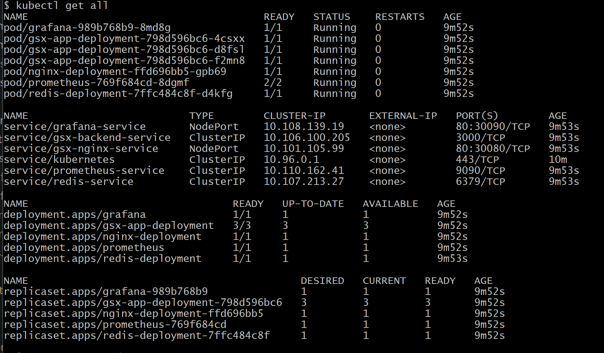
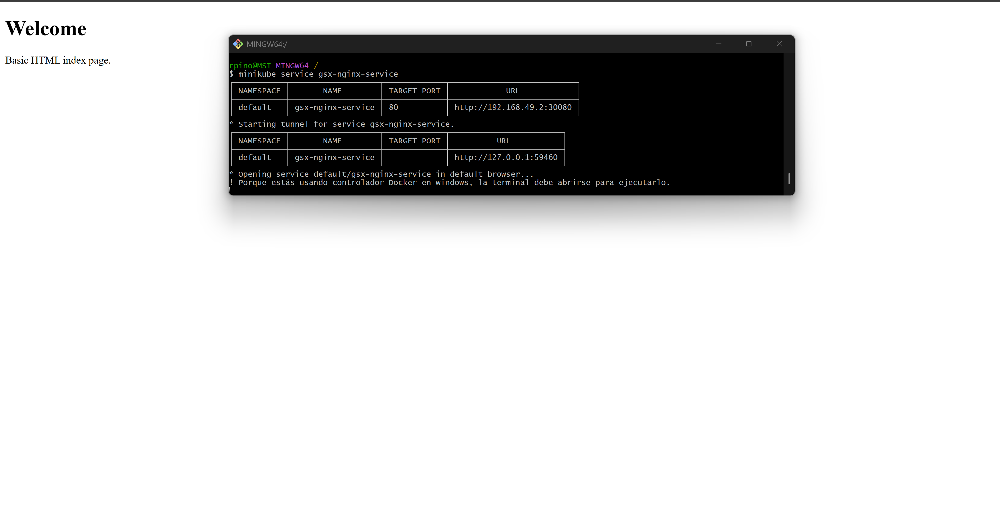
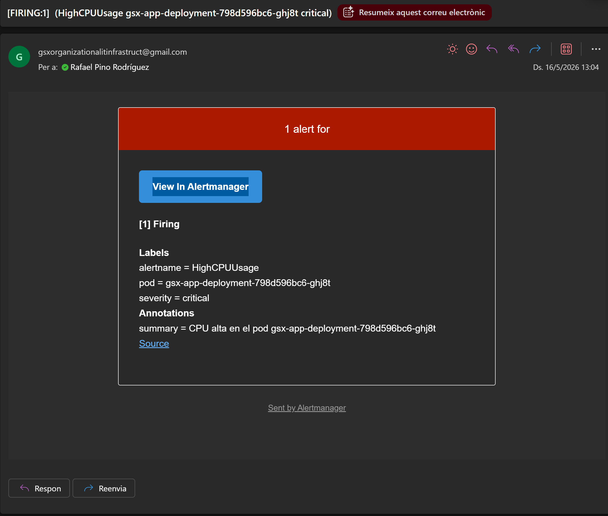

# Challenge B: Full Integration Test (Week 13)

Aquesta secció documenta la prova final d'integració requerida, demostrant que la infraestructura es pot desplegar completament des de zero utilitzant codi IaC i que tots els components funcionen i es comuniquen correctament.

## 1. Procés de Desplegament (Start from scratch & Deploy from IaC)

Per verificar la naturalesa efímera i reproduïble de la infraestructura, s'ha realitzat un desplegament automatitzat des de zero:

1. **Neteja del clúster (Start from scratch):**
   S'han eliminat tots els recursos previs executant l'script automatitzat: 
   ```bash
   ./deploy.sh 
   ```
   amb l'**Opció 3 (Netejar el clúster)**, el qual executa una purga completa amb `kubectl delete all --all`. 

2. **Desplegament automatitzat (Deploy from IaC):**
   S'ha llançat el desplegament complet mitjançant Terraform executant l'script:
      ```bash
   ./deploy.sh 
   ```
   seleccionant l'**Opció 2 (Entorn de Staging)**.

3. **Temps de desplegament (Cold Start):**
   L'arquitectura completa ha trigat exactament **2 minuts i 16 segons** en passar d'un estat de zero absolut (màquina virtual destruïda) a estar totalment operativa (`Running`).  
   *Nota tècnica:* Aquest temps inclou el provisionament de la infraestructura base i la injecció del motor de xarxa **Calico CNI** a Minikube. La instal·lació d'aquest controlador avançat és un pas indispensable que hem afegit a l'automatització per tal que el clúster pugui interpretar i fer complir de manera estricta i real les *Network Policies* (tallafocs) dissenyades per a l'entorn.

## 2. Verificació End-to-End

S'han realitzat i validat les següents proves funcionals en el clúster recent creat:

* **Serveis actius i funcionant (Services are running):**
  L'ordre `kubectl get all` mostra tots els *pods*, *replicasets* i *services* en estat actiu (`Running`). Cal destacar que el pod de Prometheus mostra un estat de contenidors `2/2` operatius, ja que integra Alertmanager com a contenidor *sidecar*.

```bash
 kubectl get all.
 ```

  


* **Comunicació interna (Services communicate with each other):**
  El descobriment de serveis DNS intern de Kubernetes funciona correctament. Des d'un terminal interactiu al pod de Nginx s'ha executat una petició interna cap al backend:
  ```bash
  kubectl exec -it deployment/nginx-deployment -- curl -s http://gsx-backend-service:3000
  ```
  La resposta obtinguda ha estat l'esperada:  
  `Hello from GreenDevCorp`.


* **Accés extern (External access works):**
  Es pot accedir al front-end exposat utilitzant el port assignat pel servei proxy (`NodePort 30080`), i la pàgina carrega completament des de l'exterior del clúster. Per fer-ho, executem:
  ```bash
  minikube service gsx-nginx-service
  ```
  


* **Mètriques en temps real (Metrics are being collected):**
  A través del túnel iniciat per l'script `./observability.sh`, l'eina Grafana recull en temps real les mètriques del clúster (App Uptime, CPU Usage, Memory Usage, i l'estat del sistema).

  


## 3. Registre d'Incidències (Troubleshooting & Issues)

Durant les fases d'integració i proves d'observabilitat de la Week 13, ens hem trobat amb diversos reptes tècnics que hem solucionat amb èxit:

1. **Estrangulament de CPU (Throttling) i alertes fallides:**
   * **Problema:** L'script de caos (`trigger_chaos.sh`) no podia saturar el processador prou com per a fer saltar l'alerta de `HighCPUUsage` (configurada al >80%). L'ús es quedava clavat al 20%.
   * **Causa i Solució:** El `limit` de CPU de Kubernetes per al pod estava fixat de forma massa estricta a `200m` (0.2 nuclis). Es va augmentar el límit a `1500m` (1,5 nuclis) dins del fitxer IaC (`main.tf`) i es va ajustar el llindar d'alerta al 60%, permetent que els atacs amb `sha256sum /dev/zero` saturéssin el pod i disparessin correctament els correus d'emergència d'Alertmanager.
   




2. **Error "No Data" als panells de CPU i Memòria a Grafana:**
   * **Problema:** Un cop integrat l'entorn de monitorització, les gràfiques de consum de recursos (CPU Usage i Memory Usage) dels contenidors apareixien buides mostrant l'avís "No Data", malgrat que els pods estaven funcionant.
   * **Causa i Solució:** Les consultes PromQL inicials recollien dades brutes de cAdvisor que no quadraven o incloïen contenidors "fantasma" del propi sistema. Es van haver de purificar les *queries* filtrant de manera estricta per *namespace* i eliminant contenidors buits (ex: afegint filtres com `container!=""` i `container!="POD"` a les expressions PromQL).

3. **Manca de dades a les mètriques de trànsit web:**
   * **Problema:** Per poder comprovar que les gràfiques d'arquitectura web (com el *Request Rate* o el *Error Rate*) funcionaven correctament, es necessitava una entrada constant d'usuaris que no teníem de forma natural a l'entorn local.
   * **Causa i Solució:** S'ha desenvolupat i executat un script dedicat a la generació de càrrega (`traffic.sh`). Aquest codi realitza un bucle constant de peticions HTTP concurrents cap a l'entrada de l'Nginx, simulant usuaris reals navegant per l'aplicació i nodrint Grafana de dades contínues i realistes per avaluar la salut de l'arquitectura.

4. **Conflicte entre "Zero Trust" (NetworkPolicies) i l'Observabilitat:**
   * **Problema:** En desplegar l'stack de monitorització sobre la infraestructura blindada de la Week 12, ens vam adonar que els panells de Grafana mostraven "No Data" i no podíem accedir a la interfície web. La política de *Default Deny* i el CNI Calico bloquejaven Prometheus, impedint-li raspar les mètriques dels contenidors, i tallaven la connexió entre Grafana i Prometheus.
   * **Causa i Solució:** Un clúster completament tancat deixa els "vigilants" a fora. Es van haver de programar noves regles (`kubernetes_network_policy`) a Terraform dedicades exclusivament a l'observabilitat. S'ha creat una excepció per permetre que Prometheus pugui fer *scraping* a tots els pods del namespace, una altra per permetre que Grafana llegeixi del port 9090 de Prometheus, i finalment s'ha permès l'accés d'ingrés extern exclusivament a les interfícies web de monitorització, mantenint la resta del backend aïllat.