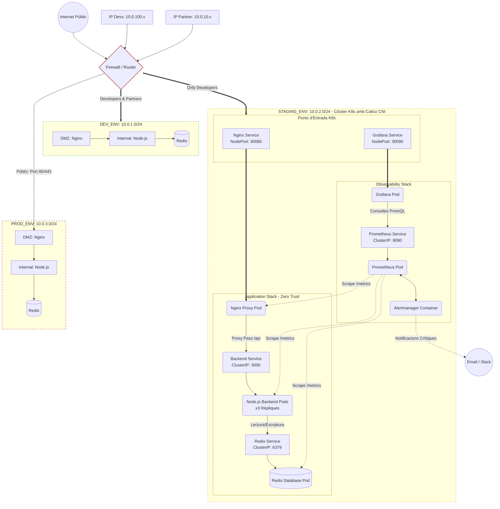

# Setmana 13: Integration, Observability & Finalitation

## 1. Diagrama de l'Arquitectura Global i Flux de Dades (Challenge C)



## 2. Anàlisi Detallat de Microserveis, Dependències i Desplegament

Aquesta secció detalla l'arquitectura de programari i xarxa per a cadascun dels components desplegats automàticament a l'entorn de Staging de GreenDevCorp mitjançant Terraform (IaC).

---

### A. Nginx Web Proxy (DMZ Layer)

* **Què fa?** Actua com a servidor web frontal i proxy invers (Ingress Controller de facto del clúster). S'encarrega d'interceptar totes les peticions HTTP externes, servir els fitxers estàtics HTML i realitzar el mecanisme de *Proxy Pass* per redirigir de manera interna les sol·licituds que apunten a l'API corporativa (`/api/`).
* **Dependències:** Depèn directament de la disponibilitat del servei de xarxa intern `gsx-backend-service` al port 3000 per poder encaminar el trànsit d'aplicació.
* **How is it deployed?** Es desplega com un recurs de Kubernetes tipus *Deployment* (`nginx-deployment`) definit íntegrament com a codi a Terraform, configurat amb una única rèplica per a l'entorn de Staging. Es troba associat a un servei de tipus `NodePort` que exposa el port intern 8080 cap a l'exterior de la xarxa al port fix **30080**.
* **How is it configured?** Es configura de forma dinàmica mitjançant un *ConfigMap* (`nginx-config`). Aquest recurs injecta el fitxer de configuració de rutes de Nginx (`default.conf`) directament a la ruta de muntatge del contenidor, evitant haver de modificar la imatge base de Docker.

### B. Node.js API Application (Internal Layer)

* **Què fa?** És el nucli lògic de l'aplicació backend (Node.js). S'encarrega de processar la lògica de negoci, exposar els endpoints d'API per als clients de GreenDevCorp i oferir l'endpoint especialitzat `/metrics` configurat per a l'extracció de telemetria en format compatible amb Prometheus.
* **Dependències:** Depèn directament del servei de base de dades `redis-service` al port 6379 per realitzar operacions d'emmagatzematge ràpid i memòria cau.
* **How is it deployed?** Es desplega mitjançant Terraform com un *Deployment* de Kubernetes (`gsx-app-deployment`). Per complir amb els requeriments d'alta disponibilitat i tolerància a fallades de l'entorn de Staging, està configurat amb **3 rèpliques** en paral·lel, gestionades internament per un servei de balançament de càrrega tipus `ClusterIP` al port 3000.
* **How is it configured?** La seva configuració s'abasteix a través del *ConfigMap* (`app-config`), el qual injecta variables d'entorn directament a l'execució dels contenidors (com per exemple el paràmetre `PORT=3000`), garantint un desacoblament absolut entre el codi font i la infraestructura.

### C. Redis Database (Storage Layer)

* **Què fa?** Funciona com el motor d'emmagatzematge de dades en memòria cau de l'aplicació, processant les lectures i escriptures d'alta velocitat de l'API.
* **Dependències:** No té cap dependència interna dins del clúster; és un servei completament autònom.
* **How is it deployed?** Es desplega com un *Deployment* de Kubernetes d'una sola rèplica (`redis-deployment`) utilitzant la imatge oficial optimitzada `redis:alpine`. Queda protegit darrere d'un servei de xarxa intern tipus `ClusterIP` (`redis-service`) que només exposa el port **6379** a la xarxa interna de l'entorn.
* **How is it configured?** Utilitza els paràmetres d'inicialització natius i lleugers de la imatge Alpine Docker. L'aïllament i seguretat de l'accés estan dictats per les polítiques de xarxa (*NetworkPolicies*) de Terraform, les quals impedeixen que qualsevol component aliè al backend s'hi pugui connectar.

### D. Prometheus Server (Observability Stack)

* **Què fa?** És el motor central de monitorització del sistema. S'encarrega de realitzar de manera periòdica el raspallat (*scraping*) de mètriques dels endpoints de l'aplicació, emmagatzemar la telemetria en una base de dades temporals (TSDB) i avaluar de manera constant les regles analítiques d'alerta.
* **Dependències:** Depèn a nivell de permisos de Kubernetes d'un *ServiceAccount* (`prometheus-sa`) lligat a un *ClusterRole* i un *ClusterRoleBinding* per poder utilitzar l'API de Kubernetes i fer *Service Discovery* automàtic dels Pods. També depèn d'Alertmanager per a l'encaminament de notificacions.
* **How is it deployed?** Es desplega mitjançant Terraform com un *Deployment* de Kubernetes (`prometheus`) amb una rèplica. Per al seu funcionament intern dins del clúster, s'associa a un servei tipus `ClusterIP` al port 9090.
* **How is it configured?** Es configura mitjançant un *ConfigMap* (`prometheus-config`) que conté dos fitxers crítics: `prometheus.yml` (on es defineixen els objectius de monitorització i els intervals de consulta de xarxa) i `alerts.yml` (on es programen les regles analítiques, com la detecció d'ús de CPU superior al 60% o taxes d'error HTTP elevades).

### E. Alertmanager (Observability Stack)

* **Què fa?** Gestiona el cicle de vida de les alertes enviades per Prometheus. S'encarrega de fer el silenciament, la deduplicació, l'agrupació i l'enviament final de les notificacions d'error cap a l'exterior del clúster.
* **Dependències:** Depèn directament dels esdeveniments enviats per Prometheus.
* **How is it deployed?** Es desplega de manera altament eficient com un contenidor complementari (*sidecar*) dins del mateix *Deployment* de Prometheus, compartint el cicle de vida i optimitzant la comunicació a través de la interfície de xarxa local del pod.
* **How is it configured?** Es configura a través del *ConfigMap* (`alertmanager-config`), el qual munta el fitxer `alertmanager.yml` on es defineix l'arbre d'encaminament crític i els canals de recepció externs (com bústies de correu corporatiu o webhooks de Slack).

### F. Grafana (Observability Stack)

* **Què fa?** És la capa visual de monitorització que permet als enginyers DevOps i SysAdmins analitzar l'estat de salut del clúster en temps real a través de quadres de comandament informatius.
* **Dependències:** Depèn exclusivament del servei `prometheus-service:9090` per poder realitzar les consultes en llenguatge PromQL.
* **How is it deployed?** Es desplega com un *Deployment* de Kubernetes (`grafana`) d'una rèplica mitjançant Terraform. Està vinculat a un servei tipus `NodePort` (`grafana-service`) que obre el port de gestió web cap a l'exterior al port fix **30090**.
* **How is it configured?** Està completament automatitzat mitjançant el *ConfigMap* (`grafana-provisioning`). Aquest recurs realitza el proveïment automàtic de la font de dades (`datasource.yml` apuntant al servei de Prometheus) i carrega des de l'inici el fitxer JSON amb el tauler mètric de producció i staging (`gsx_dashboard.json`), aconseguint un desplegament *stateless* ideal.

## 3. Operational Runbook

Aquest manual operatiu defineix els procediments estàndard per gestionar el cicle de vida de la infraestructura de GreenDevCorp.

* **How do you deploy a new version?**
    La infraestructura està completament lligada al cicle de vida del dipòsit de Git. Per desplegar una nova versió:
    1. Es genera una nova imatge de Docker automàticament etiquetada amb el hash del darrer commit (format `rafitapino/gsx-app:sha-xxxx` || `rafitapino/nginx-gsx:sha-xxxx` ).
    2. Aquest nou tag identificador s'actualitza i es configura dins dels fitxers de variables d'entorn o variables protegides/secretes (`.tfvars` de cada entorn) per mantenir desacoblat el codi de la infraestructura.
    3. S'executa el script `./deploy.sh` seleccionant l'entorn (p.e. `Staging`), el qual llegeix aquestes variables i aplica els canvis amb `terraform apply` de forma transparent.

* **How do you scale a service?**
  * **Mètode Declaratiu (Recomanat):** Modificar el paràmetre `replicas = "X"` al fitxer de variables corresponent (ex. `staging.tfvars`) i executar `terraform apply`.
  * **Mètode Imperatiu (Emergències):** Utilitzar la CLI de Kubernetes per escalar ràpidament si hi ha un pic de trànsit imprevist: `kubectl scale deployment/gsx-app-deployment --replicas=5`.

* **How do you check logs?**
    Els registres s'han de consultar utilitzant els *labels* dels pods per agregar la sortida de totes les rèpliques:
  * Backend Node.js: `kubectl logs -l app=gsx-app --tail=100 -f`
  * Nginx Proxy: `kubectl logs -l app=nginx-gsx -f`
  * Base de dades: `kubectl logs -l app=redis`

* **How do you troubleshoot a failure?**
    L'ordre estàndard d'investigació d'una fallada és:
    1. Revisar l'estat global: `kubectl get pods,svc,endpoints -o wide`
    2. Inspeccionar els esdeveniments d'un pod fallit: `kubectl describe pod <nom-del-pod>` (Cercar errors de *CrashLoopBackOff* o *OOMKilled*).
    3. Revisar el consum de recursos al clúster: `kubectl top pods` i `kubectl top nodes`.
    4. Analitzar els *logs* del contenidor afectat.

* **How do you access the observability dashboard (Challenge A)?**
    El procés d'accés està completament automatitzat mitjançant les eines locals del projecte:
    1. Des de la terminal, s'executa el fitxer de script:

       ```bash
       ./observability.sh
       ```

    2. Aquest script s'encarrega d'aixecar el túnel de xarxa i redirigir el servei de Grafana cap a un port local accessible.
    3. S'obre el navegador web a l'adreça indicada, s'inicia sessió de forma segura a Grafana introduint l'usuari i la contrasenya establerts, i es selecciona directament el panell de control (*dashboard*) personalitzat on ja es poden monitoritzar totes les mètriques en temps real.

---

## 4. Troubleshooting Guide

Guia de resolució dels problemes més comuns a l'entorn de Kubernetes.

* **Problem: "Service X can’t reach Service Y. How do I debug?"**
  * **Diagnòstic 1 (DNS i Serveis):** Verifica que el servei destí existeix i té pods assignats executant
   `kubectl get endpoints <nom-del-servei>`

    Si està buit, el *Selector* del servei està mal configurat.

  * **Diagnòstic 2 (Network Policies):** Donat que utilitzem *Zero Trust* amb Calico CNI, és altament probable que el tallafocs estigui bloquejant la connexió. Obre un terminal interactiu dins del pod d'origen i prova la connexió manualment: `kubectl exec -it <pod-origen> -- nc -w 2 -zv <servei-destí> <port>`.
  
    Si retorna `Operation timed out`, falta afegir una regla `kubernetes_network_policy` a Terraform per permetre el trànsit d'ingrés (*Ingress*).

* **Problem: "Dashboard shows high error rate. What do I check?"**
  * **Diagnòstic 1:** Revisa els logs del backend buscant excepcions o errors de codi: `kubectl logs -l app=gsx-app | grep "Error"`.
  * **Diagnòstic 2:** Comprova si la base de dades Redis està saturada o ha reiniciat, fet que provocaria timeouts a l'API: `kubectl describe pod -l app=redis`.
  * **Diagnòstic 3:** Verifica els llindars de Prometheus. Si els errors són 5xx, l'aplicació està fallant internament; si són 502/504, Nginx ha perdut la connexió amb el backend Node.js.

* **Problem: "Els pods es queden en estat 'Pending' indefinidament."**
  * **Diagnòstic:** Això sol indicar una manca de recursos al node. Executa `kubectl describe pod <pod-name>` i busca l'esdeveniment de *FailedScheduling*. Si és falta de CPU o RAM, caldrà escalar la màquina virtual de Minikube o reajustar els `resources.requests` al `main.tf`.

---
